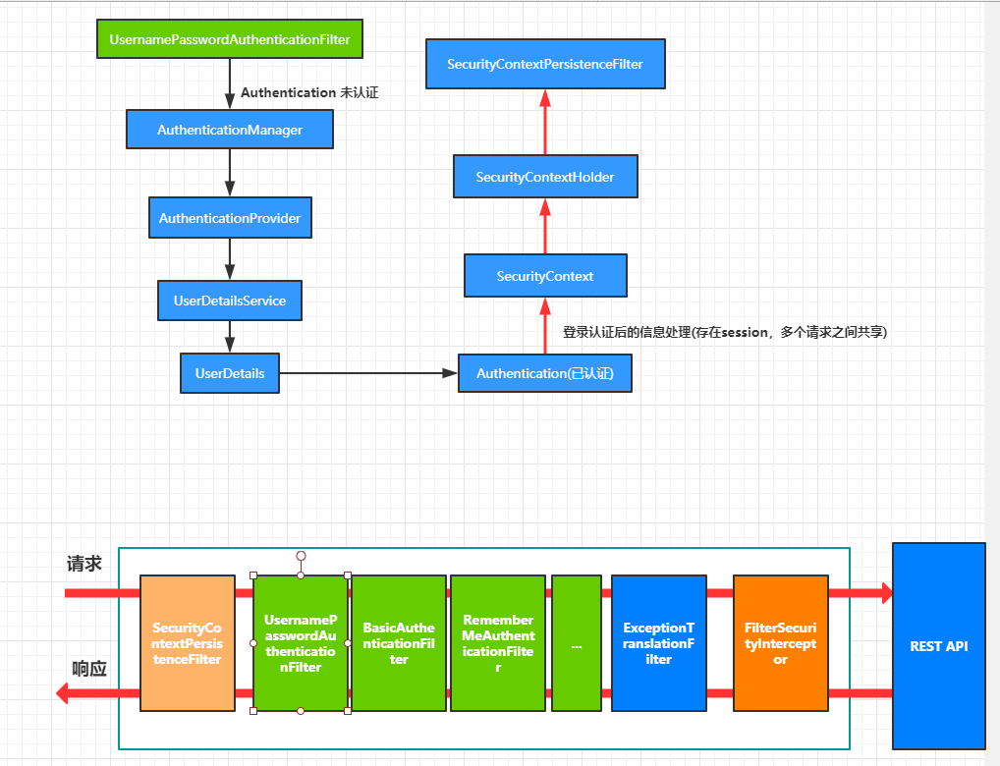
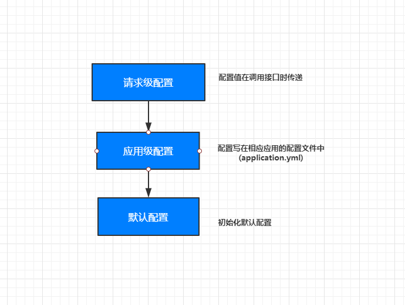
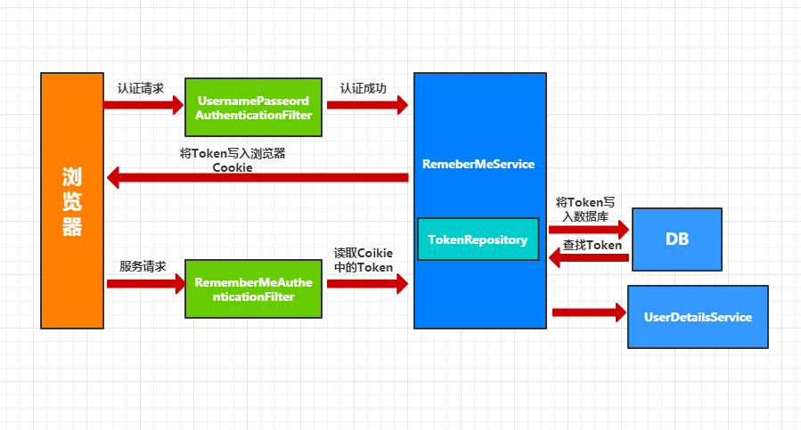
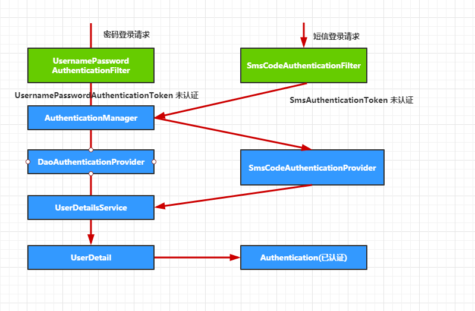
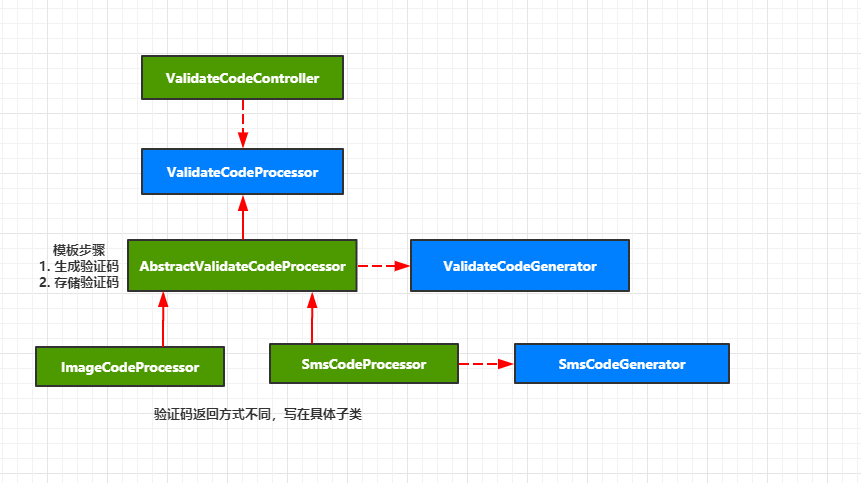

### spring security知识点
1. 企业级认证模块

    - 多种认证方式
    - 多种终端
    - 集群环境、跨应用、SESSION控制、控制用户权限、防护与身份认证相关的攻击

### spring social 第三方认证


### spring security oAuth 基于token

### 项目结构
- spring-security-base: 父项目管理版本
- spring-security-core: 核心业务逻辑
- spring-security-browser: 浏览器安全特定
- spring-security-app: app相关特定
- spring-security-demo: 样例

#### spring-security-base
- pom文件看源码

### RESTful API
 1. 用URL描述资源
 2. 使用HTTP方法描述行为，使用HTTP状态码来表示不同结果
 3. 使用json交互数据
 4. RESTful只是一种风格
 
 
### spring boot的功能点
1. RESTful请求

    - 请求方法
    
        - GetMapping  查询
        - PostMapping 添加
        - PutMapping  更新
        - DeleteMapping 删除
 
2. 测试用例
     ```java
     //查看测试用例
     ```
3. 常用注解使用

    - RestController
    
    - JsonView
        
        - 返回指定视图，与自定义视图的使用
        ```java
        @GetMapping("/{id:\\d+}")
        @JsonView(User.UserDetailView.class)
        public User getInfo() {
          return new User()
        }
        ```

4. 自定义视图(返回指定属性内容)
    ```java
    public class User {
        
        /**
        * 返回简单视图
        */
        public interface UserSimpleView {}
        
        /**
         * 返回详细视图
         */
        public interface UserDetailView extends UserSimpleView{}
        
        @JsonView(UserSimpleView.class)
        private String id;
        
        @JsonView(UserSimpleView.class)
        private String username;
        
        @JsonView(UserDetailView.class)
        private String password;
    }
    ```

5. 校验

    - 校验方式
    
        - url上的直接校验
        ```java
        @GetMapping("/{id:\\d+}")
        ```
        - 使用框架校验注解
        - 自定义校验
        ```java
            //1. 自定义注解
            @Documented
            @Target({ METHOD, FIELD})
            @Retention(RUNTIME)
            @Constraint(validatedBy = IPConstraint.class)
            public @interface IPValid {
            
                String message() default "{IPValid.message}";
            
                Class<?>[] groups() default { };
            
                Class<? extends Payload>[] payload() default { };
            
            }
      
            //2. 自定义注解处理类
              public class IPConstraint implements ConstraintValidator<IPValid, String> {
              
                  //可以使用自动注入
            
                  @Override
                  public void initialize(IPValid constraintAnnotation) {
              
                  }
              
                  @Override
                  public boolean isValid(String value, ConstraintValidatorContext context) {
                      if (Objects.nonNull(value)) {
                          //TODO 验证IP
                          return true;
                      }
                      return false;
                  }
              }
        ```

6. 自定义异常

    - 自定义异常类
    ```java
    public class UserNotExistException extends RuntimeException {
    
        private String id;
    
        public UserNotExistException(String id) {
            super("user not exist");
            this.id = id;
        }
    
        public String getId() {
            return id;
        }
    
        public void setId(String id) {
            this.id = id;
        }
    }
    ```
    - 处理自定义异常的Controller
    ```java
    @ControllerAdvice
    public class ControllerExceptionHandler {
          
        /**
         * 处理UserNotExistException异常
         */
        @ExceptionHandler(UserNotExistException.class)
        @ResponseBody
        @ResponseStatus(HttpStatus.INTERNAL_SERVER_ERROR)
        public Map<String, Object> handleUserNotExistException(UserNotExistException ex) {
            Map<String, Object> result = new HashMap<>();
            result.put("id", ex.getId());
            result.put("message", ex.getMessage());
            return result;
        }
    }
    ```
    
7. 切片拦截服务
    - Filter 过滤器
        ```
        只能拦截Http的请求和响应，无法获知请求是由哪个控制器处理,因为Filter的规范是j2ee的规范
        ```
        
        - 自定义过滤器
        ```java
          //实现Filter接口，并添加@Component注解
          import org.springframework.stereotype.Component;
          
          import javax.servlet.*;
          import java.io.IOException;
          import java.util.Date;
          
          @Component
          public class TimeFilter implements Filter {
              @Override
              public void init(FilterConfig filterConfig) throws ServletException {
                  System.out.println("time filter destroy");
              }
          
              @Override
              public void doFilter(ServletRequest request, ServletResponse response, FilterChain filterChain)
                      throws IOException, ServletException {
                  System.out.println("time filter start");
                  long start = new Date().getTime();
                  filterChain.doFilter(request, response);
                  System.out.println("time filter 耗时:"+ (new Date().getTime() - start));
                  System.out.println("time filter finish");
              }
          
              @Override
              public void destroy() {
                  System.out.println("time filter init");
              }
          }
        ```
    
        - 添加第三方拦截器
        ```java
        //通过FilterRegistrationBean注册,同上面添加@Component注解同样的效果
          @Configuration
          public class WebConfig {
          
              @Bean
              public FilterRegistrationBean filterRegistrationBean() {
                  FilterRegistrationBean registrationBean = new FilterRegistrationBean();
                  registrationBean.setFilter(new TimeFilter());
          
                  //添加拦截的url请求
                  List<String> urls = new ArrayList<>();
                  urls.add("/*");
                  registrationBean.setUrlPatterns(urls);
          
                  return registrationBean;
              }
          }
      
        ```
        
    - Interceptor 拦截器
        ```
        spring 自身提供的拦截机制(可拦截控制器的请求)，但无法获取执行方法的参数值
        ``` 
        - 拦截器实现
        ```java
        //1. 自定义拦截器类并实现HandlerInterceptor
        //2. 注册拦截器
          @Configuration
          public class WebConfig extends WebMvcConfigurerAdapter {
          
              @Autowired
              private TimeInterceptor timeInterceptor;
          
              @Override
              public void addInterceptors(InterceptorRegistry registry) {
                registry.addInterceptor(timeInterceptor);
              }  
          }   
        ```
    
    - Aspect 切片
        ```
        能够获取请求方法的参数
        ```
        - 实现
        ```java
            @Component
            @Aspect
            public class TimeAspect {
            
                @Around("execution(* UserController.*(..))")
                public Object handleControllerMethod(ProceedingJoinPoint pjp) throws Throwable {
            
                    System.out.println("time aspect start");
            
                    Object[] args = pjp.getArgs();
                    for (Object arg : args) {
                        System.out.println("arg is "+arg);
                    }
            
                    long start = new Date().getTime();
                    Object object = pjp.proceed();
                    System.out.println("time aspect 耗时:"+ (new Date().getTime() - start));
                    System.out.println("time aspect end");
            
                    return object;
                }
            }
        ```

        - 处理机制连
         ```
            入：Filter --> Interceptor --> ControllerAdvice --> Aspect --> Controller
            出：Filter <-- Interceptor <-- ControllerAdvice <-- Aspect <-- Controller                                                                 
         ```
    
8. 文件上传下载 

    - 上传
    
    - 下载

9. 异步处理REST服务
    - Callable

        -使用Callable进行异步处理，副线程写在主线程里面的 ，符合企业级开发的一般应用场景
        ```java
            @RestController
            @RequestMapping("/order")
            public class AsyncController {
            
                private Logger logger = LoggerFactory.getLogger(getClass());
            
                @GetMapping
                public Callable<String> order() throws Exception {
                    logger.info("主线程开启");
                    Callable<String> result = new Callable<String>() {
                        @Override
                        public String call() throws Exception {
                            logger.info("副线程开启");
                            Thread.sleep(2000);
                            logger.info("副线程关闭");
                            return "success";
                        }
                    };
                    logger.info("主线程关闭");
                    return result;
                }
            
            }
        ```
    - DefferedResult

        - 使用DefferedResult异步处理Rest服务，符合企业级开发的复杂应用场景
        ```java
        //下订单场景
        
        ```

- 前端交互
    - Swagger自动生成html文档
    
    - WireMock 快速伪造RESTful服务
    
### spring security 示例

#### 基本原理

1. 核心(过滤器链) 

    - UsernamePasswordAuthenticationFilter
    
    - BasicAuthenticationFilter
 
    - 还有其它过滤器
    
    - ExceptionTranslationFilter 
        ```
        捕获最后过滤器的异常
        ```
    - FilterSecurityInterceptor (最后一个过滤器)
        ```
         判断前面的认证规则是否通过,若不通过则抛出相应异常
        ```  

#### 认证

- 自定义用户认证逻辑

    - 处理用户信息获取 UserDetailsService 
        ```java
        @Service
        public class UserDetailServiceImpl implements UserDetailsService {
        
            private Logger logger = LoggerFactory.getLogger(getClass());
        
            @Override
            public UserDetails loadUserByUsername(String username)
                    throws UsernameNotFoundException {
                logger.info("登陆用户名：" + username);
                //根据用户名查询用户信息
                return new User(username, "123456", AuthorityUtils.commaSeparatedStringToAuthorityList("admin"));;
            }
        
        }
        ```
    
    - 处理用户校验 UserDetails
        ```
        //设置UserDetails相应的属性值
        isAccountNonExpired：        用户没有过期
        isAccountNonLocked：         用户没有被锁
        isCredentialsNonExpired：    凭证(密码)是否过期
        isEnabled：                  用户可用(删除状态)
        ```
    - 处理密码加密解密(PasswordEncoder)
        
        - PasswordEncoder
        ```java
          /**
           * 密码加密，用户自定义的加密
           **/
          String encode(CharSequence rawPassword);
  
          /**
           * 比较用户提交的密码是否和加密后的密码一致
           **/
          boolean matches(CharSequence rawPassword, String encodedPassword);
        ```
        
        - 配置
        ```java
            //BrowserSecurityConfig extends WebSecurityConfigurerAdapter 
            /**
             * 密码加密
             */
            @Bean
            public PasswordEncoder passwordEncoder() {
                return new BCryptPasswordEncoder();
            }
      
            //UserDetailServiceImpl implements UserDetailsService
            @Autowired
            private PasswordEncoder passwordEncoder;
      
            @Override
            public UserDetails loadUserByUsername(String username)
                    throws UsernameNotFoundException {
                logger.info("登录用户名：" + username);
          
                //应该在用户注册时的加密操作，从数据库获取的密码应该是加密后的
                String password = passwordEncoder.encode("123456");
                logger.info("登录密码：" + password);
                User user = new User(username, password, true, true, true, true,
                        AuthorityUtils.commaSeparatedStringToAuthorityList("admin"));
        
                return user;
            }
        ```
- 个性化认证流程

    - 自定义登录认证逻辑
        ```java
        //用户未授权请求时，跳转到自定义的controller处理认证逻辑(主要判断是浏览器请求还是其它rest请求)
            //配置
            //securityProperties.getBrowser().getLoginPage() 为自定义的properties属性(自定义登录页面)
            @Override
            protected void configure(HttpSecurity http) throws Exception {
                //表单验证
                http.formLogin()
                        //跳转到指定的controller处理认证逻辑
                        .loginPage("/authentication/require")
                        //通知UsernamePasswordAuthenticationFilter处理登录验证的路径
                        .loginProcessingUrl("/authentication/form")
                        .and()
                        .authorizeRequests()
                        //匹配可放行页面
                        .antMatchers("/authentication/require",
                                securityProperties.getBrowser().getLoginPage()).permitAll()
                        .anyRequest()
                        .authenticated()
                        .and()
                        //跨站伪造攻击配置
                        .csrf().disable();
            }
      
            //自定义controller
            @RequestMapping("/authentication/require")
            @ResponseStatus(code = HttpStatus.UNAUTHORIZED)
            public SimpleResponse requireAuthentication(HttpServletRequest request, HttpServletResponse response)
                    throws IOException {
        
                SavedRequest savedRequest = requestCache.getRequest(request, response);
        
                if (savedRequest != null) {
                    String targetUrl = savedRequest.getRedirectUrl();
                    logger.info("引发跳转的请求是:" + targetUrl);
                    if (StringUtils.endsWithIgnoreCase(targetUrl, ".html")) {
                        //如果是html请求，跳转到指定的的登录页
                        redirectStrategy.sendRedirect(request, response, securityProperties.getBrowser().getLoginPage());
                    }
                }
                //rest请求返回未授权信息
                return new SimpleResponse("访问的服务需要身份认证，请引导用户到登录页");
            }
        
        ```
    - 自定义登录成功处理
    
        - 实现AuthenticationSuccessHandler接口
        ```java
        /**
         * 登录成功后的处理
         * @author admin
         * <p>Date: 2019-08-26 11:36:00</p>
         */
        @Component("browserAuthenticationSuccess")
        public class BrowserAuthenticationSuccess implements AuthenticationSuccessHandler {
        
            private Logger logger = LoggerFactory.getLogger(getClass());
        
            @Autowired
            private ObjectMapper objectMapper;
        
            @Override
            public void onAuthenticationSuccess(HttpServletRequest request, HttpServletResponse response, Authentication authentication)
                    throws IOException, ServletException {
                logger.info("登录成功");
        
                response.setContentType("application/json;charset=UTF-8");
                response.getWriter().write(objectMapper.writeValueAsString(authentication));
            }
        }
        ```
        
        - 继承SavedRequestAwareAuthenticationSuccessHandler实现多种方式处理登录成功
        ```java
        @Component("browserAuthenticationSuccess")
        public class BrowserAuthenticationSuccess extends SavedRequestAwareAuthenticationSuccessHandler {
        
            private Logger logger = LoggerFactory.getLogger(getClass());
        
            @Autowired
            private ObjectMapper objectMapper;
        
            @Autowired
            private SecurityProperties securityProperties;
        
            @Override
            public void onAuthenticationSuccess(HttpServletRequest request, HttpServletResponse response, Authentication authentication)
                    throws IOException, ServletException {
                logger.info("登录成功");
        
                //判断登录成功后是否返回JSON数据还是跳转页面
                if (LoginType.JSON.equals(securityProperties.getBrowser().getLoginType())) {
                    response.setContentType("application/json;charset=UTF-8");
                    response.getWriter().write(objectMapper.writeValueAsString(authentication));
                }else {
                    //spring 默认的登录成功处理
                    super.onAuthenticationSuccess(request, response, authentication);
                }
        
            }
        }
        ```
        
    - 自定义登录失败处理
    ```java
    /**
     * 登录失败处理
     * @author admin
     * <p>Date: 2019-08-26 14:51:00</p>
     */
    @Component("browserAuthenticationFailure")
    public class BrowserAuthenticationFailure implements AuthenticationFailureHandler {
    
        private Logger logger = LoggerFactory.getLogger(getClass());
    
        @Autowired
        private ObjectMapper objectMapper;
    
        @Override
        public void onAuthenticationFailure(HttpServletRequest request, HttpServletResponse response, AuthenticationException exception)
                throws IOException, ServletException {
    
            logger.info("登录失败");
    
            response.setContentType("application/json;charset=UTF-8");
            response.getWriter().write(objectMapper.writeValueAsString(exception));
        }
    }
    ```
    
    - 继承SimpleUrlAuthenticationFailureHandler实现多种方式处理登录失败
    ```java
    @Component("browserAuthenticationFailure")
    public class BrowserAuthenticationFailure extends SimpleUrlAuthenticationFailureHandler {
    
        private Logger logger = LoggerFactory.getLogger(getClass());
    
        @Autowired
        private ObjectMapper objectMapper;
    
        @Autowired
        private SecurityProperties securityProperties;
    
        @Override
        public void onAuthenticationFailure(HttpServletRequest request, HttpServletResponse response, AuthenticationException exception)
                throws IOException, ServletException {
    
            logger.info("登录失败");
            //判断登录失败是否返回JSON数据还是跳转页面
            if (LoginType.JSON.equals(securityProperties.getBrowser().getLoginType())) {
                response.setContentType("application/json;charset=UTF-8");
                response.getWriter().write(objectMapper.writeValueAsString(exception));
            }else {
                //spring 默认的登录失败处理
                super.onAuthenticationFailure(request, response, exception);
            }
    
    
        }
    }
    ```
    
- 认证源码解读
    - 流程图
    
        
        
    - 认证处理流程说明(账号密码认证)
    ```
    1. UsernamePasswordAuthenticationFilter 拦截登录请求，获取username和password信息
    2. username和password被获得后封装到一个UsernamePasswordAuthenticationToken（Authentication接口的实例）的实例中
    3. 将UsernamePasswordAuthenticationToken的实例转递到AuthenticationManager进行认证
       3.1  账号密码的AuthenticationManager实现类为ProviderManager
       3.2  实际的认证处理有AuthenticationProvider实现，而AuthenticationManager主要是管理AuthenticationProvider
    4. AuthenticationProvider实现认证逻辑，其中账号密码认证由DaoAuthenticationProvider实现
    5. DaoAuthenticationProvider继承抽象类AbstractUserDetailsAuthenticationProvider，而AbstractUserDetailsAuthenticationProvider实现认证
        5.1 AbstractUserDetailsAuthenticationProvider的authenticate调用子类实现的方法retrieveUser获取用户的实际信息
        5.2 retrieveUser通过调用UserDetailsService的实现类(用户实现)，获取用户信息
    6. authenticate认证用户后校验用户信息(是否禁用，密码是否过期等)
    7. 从新构建UsernamePasswordAuthenticationToken对象返回，该对象包含认证后的用户信息
    8. AbstractAuthenticationProcessingFilter获取到认证信息后，将认证信息保存到上下文中SecurityContext
    9. 调用认证成功的Handler AuthenticationSuccessHandler
        
    ``` 
    - 认证结果如何在多个请求之间共享
    ```
        //AbstractAuthenticationProcessingFilter获取到认证信息后，将认证信息保存到上下文中SecurityContext
    ```
      
    - 获取认证用户信息
    ```
        //controller可通过该方式获取认证信息
        @GetMapping("/me")
        public Object getCurrentUser(Authentication authentication) {
            return authentication;
        }
    ```
- 实现图形验证码

    - 根据随机数生成图片
    - 将随机数缓存
    - 将图片写到响应中
        ```java
        //验证码对象
        @Data
        public class ImageCode {
        
            /**
             * 图形验证码
             */
            private BufferedImage image;
            /**
             * 随机数
             */
            private String code;
            /**
             * 过期时间
             */
            private LocalDateTime expireTime;
        
            public ImageCode(BufferedImage image, String code, LocalDateTime expireTime) {
                this.image = image;
                this.code = code;
                this.expireTime = expireTime;
            }
        
            /**
             *
             * @param image
             * @param code
             * @param expireIn 过期时间秒
             */
            public ImageCode(BufferedImage image, String code, int expireIn) {
                this.image = image;
                this.code = code;
                this.expireTime = LocalDateTime.now().plusSeconds(expireIn);
            }
        
        }

        //验证码请求
        @RestController
        public class ValidateCodeController {
        
            private static final String SESSION_KEY = "SESSION_KEY_IMAGE_CODE";
        
            //spring 提供操作session的工具类
            private SessionStrategy sessionStrategy = new HttpSessionSessionStrategy();
        
            @GetMapping("/code/image")
            public void createCode(HttpServletRequest request, HttpServletResponse response) throws IOException {
                // 根据随机数生成图片
                ImageCode image = generate(new ServletWebRequest(request));
                // 将随机数缓存
                sessionStrategy.setAttribute(new ServletWebRequest(request), SESSION_KEY , image);
                // 将图片写到响应中
                ImageIO.write(image.getImage(), "JPEG", response.getOutputStream());
            }
        
            private ImageCode generate(ServletWebRequest request)  {
                int width = 67;
                int height = 23;
                BufferedImage image = new BufferedImage(width, height, BufferedImage.TYPE_INT_RGB);
        
                Graphics g = image.getGraphics();
        
                Random random = new Random();
        
                g.setColor(getRandColor(200, 250));
                g.fillRect(0, 0, width, height);
                g.setFont(new Font("Times New Roman", Font.ITALIC, 20));
                g.setColor(getRandColor(160, 200));
                for (int i = 0; i < 155; i++) {
                    int x = random.nextInt(width);
                    int y = random.nextInt(height);
                    int xl = random.nextInt(12);
                    int yl = random.nextInt(12);
                    g.drawLine(x, y, x + xl, y + yl);
                }
        
                String sRand = "";
                for (int i = 0; i < 4; i++) {
                    String rand = String.valueOf(random.nextInt(10));
                    sRand += rand;
                    g.setColor(new Color(20 + random.nextInt(110), 20 + random.nextInt(110), 20 + random.nextInt(110)));
                    g.drawString(rand, 13 * i + 6, 16);
                }
        
                g.dispose();
        
                return new ImageCode(image, sRand, 60);
            }
        
            /**
             * 生成随机背景条纹
             *
             * @param fc
             * @param bc
             * @return
             */
            private Color getRandColor(int fc, int bc) {
                Random random = new Random();
                if (fc > 255) {
                    fc = 255;
                }
                if (bc > 255) {
                    bc = 255;
                }
                int r = fc + random.nextInt(bc - fc);
                int g = fc + random.nextInt(bc - fc);
                int b = fc + random.nextInt(bc - fc);
                return new Color(r, g, b);
            }
        
        }
        
         //需要放行请求验证码路径
         //验证验证码过滤器
        public class ValidateCodeFilter extends OncePerRequestFilter {
        
            private AuthenticationFailureHandler authenticationFailureHandler;
        
            private SessionStrategy sessionStrategy = new HttpSessionSessionStrategy();
        
            @Override
            protected void doFilterInternal(HttpServletRequest request, HttpServletResponse response, FilterChain filterChain)
                    throws ServletException, IOException {
                System.out.println("拦截地址： " + request.getRequestURI() + " " + request.getMethod());
                if (StringUtils.equals("/authentication/form", request.getRequestURI())
                        && StringUtils.equalsIgnoreCase(request.getMethod(), "post")) {
                    try {
                        validate(new ServletWebRequest(request));
                    }catch (ValidateCodeException e){
                        authenticationFailureHandler.onAuthenticationFailure(request, response, e);
                        return;
                    }
                }
        
                filterChain.doFilter(request, response);
            }
        
            private void validate(ServletWebRequest request) throws ServletRequestBindingException {
                ImageCode imageCode = (ImageCode) sessionStrategy.getAttribute(request, "SESSION_KEY_IMAGE_CODE");
        
                //获取提交的验证码
                String codeInRequest = ServletRequestUtils.getStringParameter(request.getRequest(), "imageCode");
                if (StringUtils.isBlank(codeInRequest)){
                    throw new ValidateCodeException("验证码不能为空");
                }
        
                if (imageCode == null){
                    throw new ValidateCodeException("验证码不存在");
                }
        
                if (imageCode.isExpried()) {
                    sessionStrategy.removeAttribute(request, "SESSION_KEY_IMAGE_CODE");
                    throw new ValidateCodeException("验证码已过期");
                }
        
                if (!StringUtils.equalsIgnoreCase(imageCode.getCode(), codeInRequest)){
                    throw new ValidateCodeException("验证码不匹配");
                }
                sessionStrategy.removeAttribute(request, "SESSION_KEY_IMAGE_CODE");
            }
        
            public AuthenticationFailureHandler getAuthenticationFailureHandler() {
                return authenticationFailureHandler;
            }
        
            public void setAuthenticationFailureHandler(AuthenticationFailureHandler authenticationFailureHandler) {
                this.authenticationFailureHandler = authenticationFailureHandler;
            }
        }
  
        //配置验证码过滤器
            @Override
            protected void configure(HttpSecurity http) throws Exception {
                ValidateCodeFilter validateCodeFilter = new ValidateCodeFilter();
                validateCodeFilter.setAuthenticationFailureHandler(browserAuthenticationFailure);
        
                // 验证码过滤器添加到账号密码验证过滤器之前
                http.addFilterBefore(validateCodeFilter, UsernamePasswordAuthenticationFilter.class)
                        //表单验证
                        .formLogin()
                        //...
            }
        ```
        
- 重构图形验证码接口
    
    - 基本参数可配置
        
        - 配置读取顺序
        
        
        - 默认配置
        ```java
           //多层级配置，可扩展
            @Data
            public class ImageCodeProperties {
            
                /**
                 * 宽度
                 */
                private int width = 67;
                /**
                 * 高度
                 */
                private int height = 23;
                /**
                 * 随机数个数
                 */
                private int length = 4;
                /**
                 * 过期时间，默认60秒
                 */
                private int expireIn = 60;
            }
  
             @Data
             public class ValidateCodeProperties {
             
                 private ImageCodeProperties image = new ImageCodeProperties();
             }
       
             @Data
             @ConfigurationProperties(prefix = "jeff.security")
             public class SecurityProperties {
             
                 private BrowserProperties browser = new BrowserProperties();
             
                 private ValidateCodeProperties code = new ValidateCodeProperties();
             
             }
        ```
        - 应用级配置
        ```yml
        #application.yml
        jeff:
          security:
            browser:
              #登录成功或失败后的处理
              login-type: JSON
            code:
              image:
                length: 6
                width: 100
        ```
        - 请求配置
        ```html
          <tr>
              <td>图形验证码:</td>
              <td>
                  <input type="text" name="imageCode">
                      
              </td>
          </tr>
        ```
        - 重构接口
        ```java
            //可配置参数
            int width = ServletRequestUtils.getIntParameter(request.getRequest(), "width",
                            securityProperties.getCode().getImage().getWidth());
            int height = ServletRequestUtils.getIntParameter(request.getRequest(), "height",
                            securityProperties.getCode().getImage().getHeight());
            //验证码长度
            for (int i = 0; i < securityProperties.getCode().getImage().getLength(); i++) {
             //...
            }
            //过期时间
            new ImageCode(image, sRand, securityProperties.getCode().getImage().getExpireIn());
        ```
        
    - 验证码拦截请求可配置(多个接口可重用)
        
        ````
           //添加可配置属性：ImageCodeProperties
          /**
           * 可配置接口(用‘,’间隔)
           */
          private String url;
          
          //application.yml
          jeff:
            security:
              code:
                image:
                  length: 6
                  width: 100
                  url: /user/*
                  
          //拦截器 ValidateCodeFilter
            @Override
             protected void doFilterInternal(HttpServletRequest request, HttpServletResponse response, FilterChain filterChain)
                     throws ServletException, IOException {
                 boolean action = false;
                 for (String url: urls) {
                     if (antPathMatcher.match(url, request.getRequestURI())){
                         action = true;
                     }
                 }
                 if (action) {
                     try {
                         validate(new ServletWebRequest(request));
                     }catch (ValidateCodeException e){
                         authenticationFailureHandler.onAuthenticationFailure(request, response, e);
                         return;
                     }
                 }
         
                 filterChain.doFilter(request, response);
             }
          //
        ````
    - 验证码生成逻辑可配置
    
        - 添加接口
        ```java
            /**
             * 验证码需实现基本接口
             * @author admin
             * <p>Date: 2019-08-27 17:02:00</p>
             */
            public interface ValidateCodeGenerator {
            
                ImageCode generate(ServletWebRequest request);
            
            }
        ```
        - 实现接口
        ```java
            public class ImageCodeGenerator implements ValidateCodeGenerator {
            
                private SecurityProperties securityProperties;
            
                @Override
                public ImageCode generate(ServletWebRequest request) {
                    int width = ServletRequestUtils.getIntParameter(request.getRequest(), "width",
                            securityProperties.getCode().getImage().getWidth());
                    int height = ServletRequestUtils.getIntParameter(request.getRequest(), "height",
                            securityProperties.getCode().getImage().getHeight());
                    BufferedImage image = new BufferedImage(width, height, BufferedImage.TYPE_INT_RGB);
            
                    Graphics g = image.getGraphics();
            
                    Random random = new Random();
            
                    g.setColor(getRandColor(200, 250));
                    g.fillRect(0, 0, width, height);
                    g.setFont(new Font("Times New Roman", Font.ITALIC, 20));
                    g.setColor(getRandColor(160, 200));
                    for (int i = 0; i < 155; i++) {
                        int x = random.nextInt(width);
                        int y = random.nextInt(height);
                        int xl = random.nextInt(12);
                        int yl = random.nextInt(12);
                        g.drawLine(x, y, x + xl, y + yl);
                    }
            
                    String sRand = "";
                    for (int i = 0; i < securityProperties.getCode().getImage().getLength(); i++) {
                        String rand = String.valueOf(random.nextInt(10));
                        sRand += rand;
                        g.setColor(new Color(20 + random.nextInt(110), 20 + random.nextInt(110), 20 + random.nextInt(110)));
                        g.drawString(rand, 13 * i + 6, 16);
                    }
            
                    g.dispose();
            
                    return new ImageCode(image, sRand, securityProperties.getCode().getImage().getExpireIn());
                }
            
                /**
                 * 生成随机背景条纹
                 */
                private Color getRandColor(int fc, int bc) {
                    Random random = new Random();
                    if (fc > 255) {
                        fc = 255;
                    }
                    if (bc > 255) {
                        bc = 255;
                    }
                    int r = fc + random.nextInt(bc - fc);
                    int g = fc + random.nextInt(bc - fc);
                    int b = fc + random.nextInt(bc - fc);
                    return new Color(r, g, b);
                }
            
                public void setSecurityProperties(SecurityProperties securityProperties) {
                    this.securityProperties = securityProperties;
                }
            }
        ```
        
        - 添加配置选项
        ```java
            @Configuration
            public class ValidateCodeBeanConfig {
            
                @Autowired
                private SecurityProperties securityProperties;
            
                /**
                 * 若提供了其他验证码接口，该验证码接不起作用
                 * 否则默认使用该验证码生成器
                 * @return
                 */
                @Bean
                @ConditionalOnMissingBean(name = "imageCodeGenerator")
                public ValidateCodeGenerator imageCodeGenerator() {
                    ImageCodeGenerator codeGenerator = new ImageCodeGenerator();
                    codeGenerator.setSecurityProperties(securityProperties);
                    return codeGenerator;
                }
            }
        ```
        
        - Controller重构
        ```java
            @RestController
            public class ValidateCodeController {
            
                private static final String SESSION_KEY = "SESSION_KEY_IMAGE_CODE";
            
                //spring 提供操作session的工具类
                private SessionStrategy sessionStrategy = new HttpSessionSessionStrategy();
            
            
                @Autowired
                private ValidateCodeGenerator imageCodeGenerator;
            
                @GetMapping("/code/image")
                public void createCode(HttpServletRequest request, HttpServletResponse response) throws IOException {
                    // 根据随机数生成图片
                    ImageCode image = imageCodeGenerator.generate(new ServletWebRequest(request));
                    // 将随机数缓存
                    sessionStrategy.setAttribute(new ServletWebRequest(request), SESSION_KEY , image);
                    // 将图片写到响应中
                    ImageIO.write(image.getImage(), "JPEG", response.getOutputStream());
                }
            
            }
        ```
- "记住我"功能

    - 基本原理
    
        ```
            1. 浏览器发起认证请求
            2. 认证成功后，调用RememberMeService服务生成Token
            3. RememberMeService服务将Token写入浏览器的Cookie中，
              并调用TokenRepository将Token写入数据库
            4. 再次进行服务请求，经过RememberMeAuthenticationFilter过滤器，
                RememberMeAuthenticationFilter 读取Cookie并将Cookie转递给RememberMeService
            5. RememberMeService根据Token查询数据库获取用户名，
              若存在用户名再调用UserDetailsService获取用户信息，并将获取的用户信息存放在ServletContext
     
        ```
    - 具体实现
    
        - 创建TokenRepository配置
        ```
        @Bean
        public PersistentTokenRepository persistentTokenRepository() {
            JdbcTokenRepositoryImpl tokenRepository = new JdbcTokenRepositoryImpl();
            tokenRepository.setDataSource(dataSource);
            tokenRepository.setCreateTableOnStartup(true);
            return tokenRepository;
        }
        
         http.addFilterBefore(validateCodeFilter, UsernamePasswordAuthenticationFilter.class)
                        //表单验证
                        .formLogin()
                        //跳转到指定的controller处理认证逻辑
                        .loginPage("/authentication/require")
                        //通知UsernamePasswordAuthenticationFilter处理登录验证的路径
                        .loginProcessingUrl("/authentication/form")
                        .successHandler(browserAuthenticationSuccess)
                        .failureHandler(browserAuthenticationFailure)
                        .and()
                        //"记住我"的配置
                        .rememberMe()
                        .tokenRepository(persistentTokenRepository())
                        .tokenValiditySeconds(securityProperties.getBrowser().getRememberMeSeconds())
                        .userDetailsService(userDetailsService)
                        .and()
                        .authorizeRequests()
                        //匹配可放行页面
                        .antMatchers("/authentication/require",
                                securityProperties.getBrowser().getLoginPage(),
                                "/code/image").permitAll()
                        .anyRequest()
                        .authenticated()
                        .and()
                        //跨站伪造攻击配置
                        .csrf().disable();            
        ```
        
    - 源码分析

- 短信验证码登录

    - 开发短信验证码接口
        - 创建短信验证码Bean ValidateCode
        ```
        //由于ImageCode和ValidateCode只是多了一个属性，所以ImageCode可以继承ValidaeCode
        ```
        - 开发短信验证码生成器 SmsCodeGenerator
        ```java
            @Component
            public class SmsCodeGenerator implements ValidateCodeGenerator {
            
                @Autowired
                private SecurityProperties securityProperties;
            
                @Override
                public ValidateCode generate(ServletWebRequest request) {
                    String code = RandomStringUtils.randomNumeric(securityProperties.getCode().getSms().getLength());
                    return new ValidateCode(code, securityProperties.getCode().getSms().getExpireIn());
                }
            }
        
            //短信可配置项
            @Data
            public class SmsCodeProperties {
            
                private int length = 6;
                /**
                 * 过期时间，默认60秒
                 */
                private int expireIn = 60;
            
                /**
                 * 可配置接口(用‘,’间隔)
                 */
                private String url;
            }
        ```
        - 短信发送器(可扩展接口)
        ```java
            public interface SmsCodeSender {
            
                void send(String mobile, String code);
            }
  
            public class DefaultSmsCodeSender implements SmsCodeSender {
            
                private Logger logger = LoggerFactory.getLogger(getClass());
            
                @Override
                public void send(String mobile, String code) {
                    logger.info("向手机【{}】发送验证码【{}】", mobile, code);
                }
            }
        ```
        - 配置
        ```java
            @Bean
            @ConditionalOnMissingBean(SmsCodeSender.class)
            public SmsCodeSender smsCodeSender() {
                return new DefaultSmsCodeSender();
            }
        ```
        - 接口调用
        ```java
            @GetMapping("/code/sms")
            public void createSmsCode(HttpServletRequest request, HttpServletResponse response) throws IOException, ServletRequestBindingException {
                // 随机数生成
                ValidateCode smsCode = smsCodeGenerator.generate(new ServletWebRequest(request));
                // 将随机数缓存
                sessionStrategy.setAttribute(new ServletWebRequest(request), SESSION_KEY , smsCode);
                // 发送短信
                String mobile = ServletRequestUtils.getStringParameter(request, "mobile");
                smsCodeSender.send(mobile , smsCode.getCode());
            }
        ```
    - 校验短信验证码并登录
    
        - 校验流程: 短信校验应该在短信验证过滤器前校验，类似图形验证码
        
        
        - SmsCodeAuthenticationFilter
        ```java
        
        ```
        
        - SmsCodeAuthenticationToken
        ```java
        
        ```
        
        - SmsCodeAuthenticationProvider
        ```java
        
        ```
       - 配置SmsCodeAuthenticationConfig
       ```java
       /** 
        * 短信配置配置core模块中为了多个模块重用
        * @author jeff
        * <p>Date 2019/8/28</p>
        */
       @Configuration
       public class SmsCodeAuthenticationConfig extends
               SecurityConfigurerAdapter<DefaultSecurityFilterChain, HttpSecurity>{
       
           @Autowired
           private AuthenticationSuccessHandler successHandler;
       
           @Autowired
           private AuthenticationFailureHandler failureHandler;
       
           @Autowired
           private UserDetailsService userDetailsService;
       
           @Override
           public void configure(HttpSecurity http) throws Exception {
               SmsCodeAuthenticationFilter smsFilter = new SmsCodeAuthenticationFilter();
               smsFilter.setAuthenticationManager(http.getSharedObject(AuthenticationManager.class));
               smsFilter.setAuthenticationSuccessHandler(successHandler);
               smsFilter.setAuthenticationFailureHandler(failureHandler);
       
               SmsCodeAuthenticationProvider smsProvider = new SmsCodeAuthenticationProvider();
               smsProvider.setUserDetailsService(userDetailsService);
       
               http.authenticationProvider(smsProvider)
                       .addFilterAfter(smsFilter, UsernamePasswordAuthenticationFilter.class);
           }
       }
       ```
       
       - 添加到spring的认证流程中
       ```java
          @Override
           protected void configure(HttpSecurity http) throws Exception {
               ValidateCodeFilter validateCodeFilter = new ValidateCodeFilter();
               validateCodeFilter.setAuthenticationFailureHandler(browserAuthenticationFailure);
               validateCodeFilter.setSecurityProperties(securityProperties);
               validateCodeFilter.afterPropertiesSet();
       
               //短信验证
               SmsCodeFilter smsCodeFilter = new SmsCodeFilter();
               smsCodeFilter.setAuthenticationFailureHandler(browserAuthenticationFailure);
               smsCodeFilter.setSecurityProperties(securityProperties);
               smsCodeFilter.afterPropertiesSet();
       
               http.addFilterBefore(validateCodeFilter, UsernamePasswordAuthenticationFilter.class)
                       .addFilterBefore(smsCodeFilter, UsernamePasswordAuthenticationFilter.class)
                       //表单验证
                       .formLogin()
                       //跳转到指定的controller处理认证逻辑
                       .loginPage("/authentication/require")
                       //通知UsernamePasswordAuthenticationFilter处理登录验证的路径
                       .loginProcessingUrl("/authentication/form")
                       .successHandler(browserAuthenticationSuccess)
                       .failureHandler(browserAuthenticationFailure)
                       .and()
                       //"记住我"的配置
                       .rememberMe()
                       .tokenRepository(persistentTokenRepository())
                       .tokenValiditySeconds(securityProperties.getBrowser().getRememberMeSeconds())
                       .userDetailsService(userDetailsService)
                       .and()
                       .authorizeRequests()
                       //匹配可放行页面
                       .antMatchers("/authentication/require",
                               securityProperties.getBrowser().getLoginPage(),
                               "/code/*").permitAll()
                       .anyRequest()
                       .authenticated()
                       .and()
                       //跨站伪造攻击配置
                       .csrf().disable()
                       // 添加短信认证流程到认证流程中
                       .apply(smsCodeAuthenticationConfig);
           }
       ```
        
    - 重构
    
        - 重构后的结构
        
        
        - ValidateCodeProcessor
        ```java
        
        ```
        
        - AbstractValidateCodeProcessor
        ```java
        
        ```
        
        - ImageCodeProcessor
        ```java
        
        ```
        
        - SmsCodeProcessor
        ```java
        
        ```
        
        - ValidateCodeController
        ```java
        
        ```
        
#### 授权

#### 攻击防护(伪造用户身份)

#### 配置(extends WebSecurityConfigurerAdapter)

1. 表单认证
    ```java
            @Override
            protected void configure(HttpSecurity http) throws Exception {
                //表单验证
                http.formLogin()
                        .and()
                        .authorizeRequests()
                        .anyRequest()
                        .authenticated();
            }
    ```
      